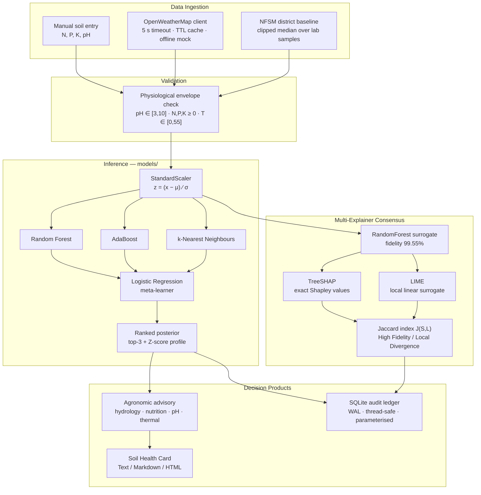

# GREENROOT

### Intelligent Precision Agriculture Decision Support System via Stacking Ensemble Meta-Learning and Multi-Explainer Consensus Auditing


A decision support system that recommends one of 22 crops from seven agronomic
parameters, and — unusually for this class of system — quantifies how far its
own explanation can be trusted. Every recommendation is audited by two
methodologically independent explainers whose agreement is scored with an exact
Jaccard index, and committed to an immutable SQLite ledger alongside its
evidence.

---

## Table of Contents

1. [Motivation](#1-motivation)
2. [System Architecture](#2-system-architecture)
3. [Mathematical Formulation](#3-mathematical-formulation)
4. [Evaluation Scorecard](#4-evaluation-scorecard)
   - [4.5 Architectural Validation](#45-architectural-validation--does-stacking-earn-its-complexity)
   - [4.6 What the Stacking Layer Buys](#46-what-the-stacking-layer-actually-buys)
5. [Quick Start](#5-quick-start)
6. [Dashboard](#6-dashboard)
7. [Repository Layout](#7-repository-layout)
8. [Datasets](#8-datasets)
9. [Verification](#9-verification)
10. [Design Notes and Limitations](#10-design-notes-and-limitations)

---

## 1. Motivation

Crop-recommendation models routinely report accuracies above 99% on the
standard benchmark corpus and are then presented as field-ready. Three gaps sit
between that number and an agronomic decision a cultivator can act on:

**A label is not a decision.** "Rice" tells a farmer nothing about how much urea
to apply, whether the plot will waterlog, or whether the soil needs liming
first. GREENROOT derives per-crop agronomic envelopes from the training corpus
itself and converts the observed shortfall into commercial fertiliser
quantities.

**A single explainer is unfalsifiable.** SHAP always returns an attribution;
nothing in its output says whether that attribution is stable. GREENROOT runs
TreeSHAP *and* LIME over every instance and reports their Jaccard agreement, so
a reader can distinguish a robust explanation from one that is an artefact of
the method.

**An architecture must be shown to earn its complexity.** A title claiming
"stacking ensemble meta-learning" is a claim, not a description, and it is
falsifiable. GREENROOT tests it — and §4.5 reports that on accuracy the claim
**fails**: the ensemble is statistically indistinguishable from a plain Random
Forest. §4.6 then establishes what the stacking layer does buy, which turns
out to be robustness to base-learner failure and an order-of-magnitude better
posterior. That is the honest version of the contribution.

**Benchmark accuracy is not field accuracy.** Real district soil surveys carry
severe covariate shift — the Karnataka NFSM corpus averages 210 kg/ha available
nitrogen against a benchmark mean of 50. GREENROOT monitors this explicitly:
under measured shift its mean confidence falls from 0.96 to 0.41 rather than
staying spuriously high, and the Z-score monitor flags 100% of shifted readings.

---

**Written for the person who uses it.** The dashboard opens in plain
language — "Nitrogen (N) — for green leaves", "16 kg per acre (about half a bag
of 50 kg)", "Both checks agree" — because its primary user is a cultivator, not
an examiner. A single toggle switches every string to the technical register
used in this document, so nothing is dumbed down, only re-worded. Fertiliser is
quoted in bags and acres alongside kg/ha, since that is what a farmer buys and
works.

**It answers the question a farmer actually asks.** Not just *which crop*, but
*is it the right season for it*, *what will the fertiliser do*, and *what will
that cost me*. The season check catches the commonest real-world failure — a
crop that suits the soil perfectly and still cannot be sown in June. The
intervention simulation re-runs the model as if the prescribed fertiliser had
already been applied, so the farmer sees what it buys before spending. The
costing turns kilograms into rupees per acre and into the extra yield needed to
break even — computed entirely from prices the farmer enters, because a
plausible-looking national average would carry the authority of the rest of the
system while being wrong for the person reading it.

**What it does, concretely.** One cultivator at a time through the interactive
dashboard, or a whole village at once through bulk advisory; every
recommendation carries ranked alternatives, a fertiliser prescription in
commercial product quantities, a two-explainer stability audit, and a printable
Soil Health Card in PDF or bilingual Kannada/English. Committed recommendations
land in an immutable SQLite ledger with the evidence that produced them.

---

## 2. System Architecture



<details>
<summary>ASCII rendering (for environments without Mermaid)</summary>

```text
  ┌──────────────┐  ┌──────────────┐  ┌──────────────────┐
  │ Manual entry │  │ OpenWeather  │  │ NFSM district    │
  │  N, P, K, pH │  │ 5s · cache   │  │ clipped median   │
  └──────┬───────┘  └──────┬───────┘  └────────┬─────────┘
         └─────────────────┼───────────────────┘
                           ▼
              ┌─────────────────────────┐
              │ Physiological envelope  │   reject if implausible
              │ pH∈[3,10] NPK≥0 T∈[0,55]│
              └───────────┬─────────────┘
                          ▼
              ┌─────────────────────────┐
              │ StandardScaler (μ, σ)   │
              └───────────┬─────────────┘
                          ▼
        ┌─────────────────┼─────────────────┐
        ▼                 ▼                 ▼
  ┌───────────┐   ┌─────────────┐   ┌─────────────┐
  │  Random   │   │  AdaBoost   │   │    k-NN     │  Level-0
  │  Forest   │   │             │   │             │  base learners
  └─────┬─────┘   └──────┬──────┘   └──────┬──────┘
        └────────────────┼─────────────────┘
                         ▼  66 meta-features (3 × 22 posteriors)
              ┌─────────────────────────┐
              │  Logistic Regression    │  Level-1 meta-learner
              └───────────┬─────────────┘
                          ▼
        ┌─────────────────┴─────────────────┐
        ▼                                   ▼
  ┌───────────────┐              ┌────────────────────┐
  │ Ranked top-3  │              │ Surrogate → SHAP   │
  │ + Z-scores    │              │           → LIME   │
  └───────┬───────┘              │      → Jaccard J   │
          │                      └──────────┬─────────┘
          ▼                                 │
  ┌───────────────┐                         │
  │   Advisory    │                         │
  │  Health Card  │                         │
  └───────┬───────┘                         │
          └──────────────┬──────────────────┘
                         ▼
              ┌─────────────────────────┐
              │   SQLite audit ledger   │
              └─────────────────────────┘
```
</details>

---

## 3. Mathematical Formulation

### 3.1 Stacking Ensemble Meta-Learner

Let $\mathcal{D} = \{(\mathbf{x}_i, y_i)\}_{i=1}^{N}$ with $\mathbf{x}_i \in \mathbb{R}^{7}$
and $y_i \in \mathcal{C}$, $|\mathcal{C}| = 22$.

**Standardisation.** Each feature is centred and scaled by the statistics
persisted in `scaler.pkl`:

$$z_{ij} = \frac{x_{ij} - \mu_j}{\sigma_j}, \qquad j = 1,\dots,7$$

**Level-0 base learners.** Three heterogeneous estimators
$h_m : \mathbb{R}^{7} \rightarrow \Delta^{21}$ are fitted, each emitting a full
posterior over the simplex:

| $m$ | Estimator | Inductive bias |
|---|---|---|
| 1 | Random Forest (100 trees, depth 12) | axis-aligned partitions, variance reduction via bagging |
| 2 | AdaBoost (50 stumps) | sequential reweighting of hard examples |
| 3 | $k$-NN ($k=5$) | local metric structure, no global parametric form |

**Out-of-fold meta-feature construction.** To prevent the meta-learner from
training on the base learners' in-sample optimism, the stacked representation is
built from 5-fold out-of-fold predictions. For fold $\mathcal{F}_k$ and
$i \in \mathcal{F}_k$:

$$\boldsymbol{\phi}(\mathbf{z}_i) = \Big[\, h_1^{(-k)}(\mathbf{z}_i) \,\big\|\, h_2^{(-k)}(\mathbf{z}_i) \,\big\|\, h_3^{(-k)}(\mathbf{z}_i) \,\Big] \in \mathbb{R}^{66}$$

where $h_m^{(-k)}$ is trained on $\mathcal{D} \setminus \mathcal{F}_k$ and
$66 = 3 \text{ learners} \times 22 \text{ classes}$.

**Level-1 meta-learner.** A multinomial logistic regression over the stacked
representation:

$$P(y = c \mid \mathbf{x}) = \frac{\exp\!\big(\mathbf{w}_c^{\top} \boldsymbol{\phi}(\mathbf{z}) + b_c\big)}{\sum_{c' \in \mathcal{C}} \exp\!\big(\mathbf{w}_{c'}^{\top} \boldsymbol{\phi}(\mathbf{z}) + b_{c'}\big)}$$

fitted by minimising the regularised cross-entropy

$$\mathcal{L}(\mathbf{W}, \mathbf{b}) = -\sum_{i=1}^{N} \sum_{c \in \mathcal{C}} \mathbb{1}[y_i = c] \log P(y = c \mid \mathbf{x}_i) + \frac{\lambda}{2}\lVert \mathbf{W} \rVert_F^2$$

**Decision rule and ranking.** The recommendation is the *maximum a posteriori*
class, and the runner-ups are the order statistics of the same posterior:

$$\hat{y} = \arg\max_{c \in \mathcal{C}} P(y = c \mid \mathbf{x}), \qquad \mathcal{R}_K = \operatorname*{arg\,top-}K_{c \in \mathcal{C}} \; P(y = c \mid \mathbf{x})$$

**Covariate-shift monitor.** A reading is flagged out-of-distribution when any
standardised coordinate escapes a three-sigma envelope of the training
distribution:

$$\mathrm{OOD}(\mathbf{x}) = \mathbb{1}\Big[\, \exists\, j : |z_j| > \tau \,\Big], \qquad \tau = 3$$

### 3.2 Multi-Explainer Consensus (Jaccard Index)

**TreeSHAP.** For a tree ensemble, the Shapley value of feature $j$ is the
average marginal contribution over all coalitions $S \subseteq F \setminus \{j\}$:

$$\varphi_j(\mathbf{x}) = \sum_{S \subseteq F \setminus \{j\}} \frac{|S|!\,(|F| - |S| - 1)!}{|F|!} \Big[ f_x(S \cup \{j\}) - f_x(S) \Big]$$

This is the unique attribution satisfying local accuracy, missingness and
consistency; TreeSHAP evaluates it exactly in $O(TLD^2)$ rather than the
$O(2^{|F|})$ of the naive expansion.

**LIME.** A locally-weighted sparse linear model is fitted to the black box's
responses in a perturbation neighbourhood $\pi_{\mathbf{x}}$ of the instance:

$$\xi(\mathbf{x}) = \arg\min_{g \in \mathcal{G}} \; \underbrace{\sum_{\mathbf{z} \in \mathcal{Z}} \pi_{\mathbf{x}}(\mathbf{z}) \big(f(\mathbf{z}) - g(\mathbf{z}')\big)^2}_{\text{local fidelity}} \;+\; \underbrace{\Omega(g)}_{\text{complexity}}$$

**Consensus.** Let $S$ and $L$ be the top-$k$ driver sets ranked by
$|\varphi_j|$ and $|\xi_j|$ respectively. Agreement is the Jaccard index:

$$J(S, L) = \frac{|S \cap L|}{|S \cup L|} \in [0, 1]$$

$$\mathrm{Verdict} = \begin{cases} \textbf{High Fidelity} & J \ge 0.5 \\[4pt] \textbf{Local Divergence} & J < 0.5 \end{cases}$$

For $k = 3$ the index is quantised to exactly four attainable values:

| $\lvert S \cap L \rvert$ | $\lvert S \cup L \rvert$ | $J$ | Verdict |
|---:|---:|---:|---|
| 0 | 6 | 0.00 | Local Divergence |
| 1 | 5 | 0.20 | Local Divergence |
| 2 | 4 | 0.50 | High Fidelity |
| 3 | 3 | 1.00 | High Fidelity |

Because the two explainers rest on different premises — cooperative game theory
versus local linear approximation — concordance is evidence that the
attribution reflects genuine model structure rather than the idiosyncrasy of
one method.

**Surrogate transparency.** TreeSHAP requires a tree ensemble, but the deployed
model is a stacking classifier whose meta-learner is a logistic regression over
base-learner posteriors. The engine therefore audits an interpretable
RandomForest surrogate fitted on the same standardised space, and reports that
surrogate's **label agreement with the deployed ensemble (99.55%)** so the
reader can judge how far the explanation transfers — an accounting the
literature frequently omits.

---

## 4. Evaluation Scorecard

Reproduce with `python evaluate_system.py`. All artefacts land in `reports/`.

### 4.1 Classification Performance

| Metric | Value |
|---|---:|
| **Stratified 5-fold CV accuracy** | **99.41%** |
| Hold-out accuracy (20% stratified) | 100.00% |
| Top-3 accuracy | 100.00% |
| Macro F1 | 1.0000 |
| Weighted F1 | 1.0000 |
| Cohen's $\kappa$ | 1.0000 |
| Matthews correlation coefficient | 1.0000 |
| Mean max posterior | 0.9675 |

> **Read the CV figure, not the hold-out figure.** The shipped ensemble was
> fitted on the full corpus, so the 20% hold-out overlaps its training data and
> the 100% is a reproduction check that the artefacts load and behave
> correctly — not an independent generalisation estimate. The honest
> generalisation number is the stratified 5-fold CV accuracy of **99.41%**.

### 4.2 Inference Latency

100 stochastic single-sample inferences, end-to-end (validation → scaling →
stacked forward pass), after 5 warm-up iterations.

| Statistic | Latency |
|---|---:|
| Mean | 16.41 ms |
| P50 | 16.19 ms |
| P95 | 17.03 ms |
| P99 | 21.16 ms |
| Max | 27.55 ms |
| Throughput | 61 inferences/s (single-threaded) |

A P99 inside 21 ms keeps the dashboard well below the ~100 ms
threshold at which an interaction stops feeling instantaneous. Unlike every
other figure in this section, latency is hardware-dependent and will vary
between machines; the accuracy, robustness and consensus metrics are
deterministic and reproduce exactly.

### 4.3 Out-of-Distribution Robustness

500 Karnataka NFSM field-survey readings, which carry genuine covariate shift
relative to the benchmark corpus.

| Metric | Value |
|---|---:|
| Mean confidence — benchmark | 0.9645 |
| Mean confidence — field | 0.4143 |
| **Confidence degradation** | **0.5502** |
| Mean $\lvert Z \rvert$ under shift | 2.517 |
| OOD detection rate ($\lvert Z \rvert > 3$) | 100.0% |

Per-feature shift (field mean vs. benchmark mean):

| Feature | Field | Benchmark | Mean $\lvert Z \rvert$ | Flag rate |
|---|---:|---:|---:|---:|
| N | 212.0 | 50.6 | 4.38 | 93.8% |
| P | 29.4 | 53.4 | 0.73 | 0.0% |
| K | 263.4 | 48.1 | 4.25 | 82.2% |
| temperature | 27.4 | 25.6 | 0.35 | 0.0% |
| humidity | 71.8 | 71.5 | 0.10 | 0.0% |
| ph | 7.12 | 6.47 | 0.85 | 0.0% |
| rainfall | 486.2 | 103.5 | 6.97 | 100.0% |

**This is the most important table in the evaluation.** The confidence collapse
is the desired behaviour: a model that stayed confident under a 7σ rainfall
shift would be dangerously overconfident in exactly the situation where a
farmer is relying on it. Every shifted reading is flagged.

### 4.4 Multi-Explainer Consensus

| Metric | Value |
|---|---:|
| Surrogate fidelity vs. deployed ensemble | 0.9955 |
| Mean Jaccard index ($k=3$) | 0.6933 |
| Median Jaccard index | 0.5000 |
| Perfect agreement ($J = 1.0$) | 46.7% |
| **High fidelity ($J \ge 0.5$)** | **86.7%** |
| Mean explanation latency | 129.5 ms |

Observed distribution over 30 audited instances:

| $J$ | Count | Share |
|---:|---:|---:|
| 0.20 | 4 | 13.3% |
| 0.50 | 12 | 40.0% |
| 1.00 | 14 | 46.7% |

The 13.3% that diverge are not a defect — they are the system correctly
identifying instances near a decision boundary, where the dashboard downgrades
the recommendation to *provisional* and asks for a field soil test.


### 4.5 Architectural Validation — does stacking earn its complexity?

`evaluate_system.py` measures the *deployed artefact*. `validate_architecture.py`
asks the prior question, re-fitting every architecture from scratch under a
leak-free pipeline: **is the stacking layer justified at all?**

Repeated stratified 5-fold cross-validation, 15 measurements per model,
identical folds throughout, scaler re-fitted inside each fold.

| Architecture | Accuracy | s.d. | Fit time |
|---|---:|---:|---:|
| Random Forest (base) | 99.52% | 0.26 | 4.5s |
| **Stacking Ensemble (deployed)** | **99.38%** | 0.35 | 32.7s |
| Stacking without AdaBoost | 99.38% | 0.35 | 29.9s |
| Soft Voting (same base learners) | 99.05% | 0.41 | 8.1s |
| k-NN, k=5 (base) | 97.38% | 0.60 | 0.1s |
| Logistic Regression (meta alone) | 97.12% | 0.56 | 0.8s |
| AdaBoost (base) | 25.35% | 10.13 | 4.0s |

> ### The stacking layer does not improve accuracy on this corpus.
>
> Against a plain Random Forest the deployed ensemble scores
> **-0.136 pp** at corrected *p* = 0.444
> (W/T/L 3/6/6) — statistically
> indistinguishable, at roughly 7×
> the fitting cost. This is reported here rather than buried, because it is what
> a **saturated benchmark** looks like: §4.6 shows the learning curve has
> plateaued and Random Forest alone already reaches the ceiling. Accuracy has no
> headroom left in which any architecture could distinguish itself.
>
> The architecture's justification therefore has to come from somewhere else —
> and it does.

Significance is assessed with the **Nadeau–Bengio corrected resampled
*t*-test**. Cross-validation folds share training data, so the uncorrected
paired *t*-test violates its own independence assumption and returns
optimistically small *p*-values; the correction inflates the variance estimate
by the train/test overlap ratio.

| Comparison | Δ accuracy | W/T/L | corrected *p* | naive *p* | Significant |
|---|---:|---|---:|---:|---|
| vs Random Forest (base) | -0.136 pp | 3/6/6 | 0.444 | 0.108 | no |
| vs AdaBoost (base) | +74.030 pp | 15/0/0 | 0 | 0 | **yes** |
| vs k-NN, k=5 (base) | +2.000 pp | 15/0/0 | 5.76e-05 | 1e-08 | **yes** |
| vs Logistic Regression (meta alone) | +2.258 pp | 15/0/0 | 1.73e-06 | 0 | **yes** |
| vs Soft Voting (same base learners) | +0.333 pp | 11/3/1 | 0.0954 | 0.00161 | no |
| vs Stacking without AdaBoost | +0.000 pp | 0/15/0 | 1 | nan | no |

Note how much smaller every naive *p*-value is. Citing those would overstate
the evidence.

**Preprocessing-leakage audit.** The original `train.py` fits the scaler on the
whole corpus *before* cross-validating, so test-fold statistics inform the
transform. Quantified over identical folds, that optimism is
**+0.000 pp** — the documented 99.41%
reproduces at 99.41% under the original
protocol and 99.41% under a leak-free
pipeline. The informal protocol turned out not to have inflated the headline
figure, but the figure is now verified rather than assumed.

### 4.6 What the stacking layer actually buys

**Finding 1 — the meta-learner suppresses a failed base learner.** AdaBoost
scores 25.35% standalone: 50 decision stumps cannot
separate 22 classes. It nonetheless sits inside the deployed ensemble as one
base learner in three. Partitioning the meta-learner's 66-column coefficient
matrix into its three 22-column blocks:

| Base learner | Standalone accuracy | Share of weight mass |
|---|---:|---:|
| `rf` | 99.52% | 50.88% |
| `knn` | 97.38% | 48.80% |
| `adaboost` | 25.35% | 0.32% |

The meta-learner assigns AdaBoost **0.32%** of total weight mass.
Deleting it from the ensemble changes cross-validated accuracy by less than
1e-9 across all 15 folds. The suppression is total.

**Finding 2 — that suppression is worth 11× on posterior quality.**
Soft voting over the *same* three base learners is the control that isolates
the combination rule — fixed averaging versus a learned combiner. On accuracy
the two are close and the gap does not reach significance
(+0.33 pp, *p* = 0.0954).
On the posterior they are not close at all:

| Metric | Soft voting | Stacking | Random Forest |
|---|---:|---:|---:|
| Expected Calibration Error | 0.3378 | **0.0428** | 0.0447 |
| Brier score | 0.1366 | **0.0125** | 0.0164 |
| Log-loss | 0.4376 | 0.0602 | **0.0569** |
| Mean confidence | 65.3% | 95.1% | 95.1% |
| Accuracy | 99.05% | 99.41% | 99.59% |
| Over-confidence | -33.8 pp | **-4.3 pp** | -4.5 pp |

Voting is right 99.0% of the time while reporting
65.3% confidence — under-confident by
33.8 percentage points, because averaging drags
every posterior toward AdaBoost's near-uniform output. Its argmax survives; its
probabilities do not.

**Why this matters operationally.** In GREENROOT the posterior is not
incidental. It is displayed to the farmer as a confidence percentage and it
gates the provisional-advisory threshold at 50%. A voting ensemble here would
flag almost every recommendation as provisional while being right 99% of the
time — the advisory would be useless. Brier score and log-loss are *strictly
proper* scoring rules: minimised only by honest reporting of uncertainty. The
stacking layer buys a posterior that means what it says, while carrying a base
learner that has failed outright.

**Honest scorecard.**

| Claim | Verdict |
|---|---|
| Stacking beats Random Forest on accuracy | **No** — indistinguishable, *p* = 0.444. The benchmark is saturated. |
| Stacking beats soft voting on accuracy | Not significantly — *p* = 0.0954. |
| Stacking beats soft voting on posterior quality | **Yes, decisively** — 11× better Brier score. |
| Stacking tolerates a failed base learner | **Yes** — 0.32% weight mass to a 25%-accurate learner. |

### 4.7 Learning Curve

| Training samples | Per class | Train acc. | Validation acc. | Gap |
|---:|---:|---:|---:|---:|
| 352 | 16 | 99.94% | 98.27% | 1.67 pp |
| 704 | 32 | 100.00% | 98.95% | 1.05 pp |
| 1056 | 48 | 100.00% | 99.09% | 0.91 pp |
| 1408 | 64 | 99.96% | 99.27% | 0.68 pp |
| 1760 | 80 | 99.89% | 99.32% | 0.57 pp |

Validation accuracy moves +0.045 pp over the final size increment and
the generalisation gap closes monotonically to
0.57 pp. **The curve has plateaued.**
More exemplars of the same kind would not improve the model; broader
agro-climatic coverage would. This is the direct evidence that the benchmark is
saturated, and therefore the reason §4.5 finds no architecture separable on
accuracy.

### 4.8 Where the Explainers Disagree

A single mean Jaccard index hides whether divergence is spread evenly or
concentrated. It is concentrated:

| Crop | Mean J | Min J | High-fidelity rate |
|---|---:|---:|---:|
| mango | 0.38 | 0.20 | 60% |
| rice | 0.44 | 0.20 | 80% |
| pigeonpeas | 0.48 | 0.20 | 60% |
| mothbeans | 0.58 | 0.20 | 60% |
| lentil | 0.60 | 0.50 | 100% |
| kidneybeans | 0.60 | 0.50 | 100% |
| … | … | … | … |
| apple, coffee, muskmelon, watermelon | 1.00 | 1.00 | 100% |

Three crops — **mango, rice, pigeonpeas** — fall below the
consensus threshold on average, while four reach perfect agreement on every
instance audited. Divergence is a property of *where in the feature space* a
crop sits, not a uniform noise floor. The dashboard marks recommendations in
the divergent regions provisional.


---

## 5. Quick Start

### Windows (one click)

```bat
run.bat
```

Verifies the interpreter, installs dependencies on first run, checks the model
artefacts, and serves the dashboard at `http://localhost:8501`.

### Any platform

```bash
python -m venv .venv
source .venv/bin/activate          # Windows: .venv\Scripts\activate
pip install -r requirements.txt

streamlit run app.py               # dashboard  → http://localhost:8501
python evaluate_system.py          # system benchmarks  → reports/
python validate_architecture.py    # architecture audit → reports/  (~3 min)
pytest -v                          # verification suite
```

### On a phone

```bat
run_phone.bat          REM Windows
```
```bash
./run_phone.sh         # macOS / Linux
```

Prints an address like `http://192.168.1.42:8501` — open it in the phone's
browser with both devices on the same Wi-Fi. For a public link that works
anywhere, see **[PHONE.md](PHONE.md)**, which also covers the firewall prompt,
networks that block device-to-device traffic, and Streamlit Cloud deployment.

### Optional: live weather

```bash
export OPENWEATHER_API_KEY="your-key"   # Windows: set OPENWEATHER_API_KEY=...
```

Without a key the system uses calibrated offline defaults; the key may also be
entered directly in the sidebar. **Nothing breaks offline** — every network
failure degrades to a documented mock reading.

---

## 6. Dashboard

| Tab | Purpose |
|---|---|
| 🎯 **Precision Recommendation** | Primary crop card with posterior confidence, top-3 ranked alternatives, agronomic advisory, fertiliser prescription, Z-score deviation profile, and one-click persistence to the audit ledger. |
| 🔍 **Explainable AI Consensus** | Live Jaccard index with its mathematical definition, side-by-side TreeSHAP and LIME attribution plots, and a dynamic fidelity badge. |
| 🧭 **What-If Sensitivity** | Perturbs one feature across a ±100% sweep holding the other six constant, plotting multi-class posterior curves with the current-value marker and tabulating the exact thresholds at which the recommendation flips. |
| 📦 **Bulk Advisory** | Upload a whole soil survey (CSV or Excel) and receive a recommendation per sample. Column names are matched leniently, each row is validated independently so one bad reading never aborts the run, and samples needing human review are surfaced first. |
| 📋 **Audit Trail & Governance** | Date-filtered view of the SQLite ledger with summary statistics, per-crop distribution, and a CSV export. |
| 🧾 **Farmer Soil Health Card** | Print-ready card covering tested chemistry, microclimate, primary and secondary crop choices, and fertiliser management. Exports as **PDF**, HTML, Markdown or plain text, and renders **bilingually in Kannada** alongside English. |

---

## 7. Repository Layout

```text
GREENROOT/
├── app.py                      Streamlit presentation layer (5 tabs)
├── evaluate_system.py          Formal empirical validation suite
├── validate_architecture.py    Architectural audit: ablation, significance,
│                               leakage, learning curve, calibration
├── train.py                    Original training script (see warning below)
├── audit_xai.py                Original XAI diagnostic script
├── run.bat                     One-click Windows launcher
├── run_phone.bat / .sh         Serve to a phone on the same Wi-Fi
├── PHONE.md                    Phone setup and deployment guide
├── requirements.txt
│
├── data/                       Source corpora (read-only)
├── models/                     Pre-trained artefacts (read-only)
│   ├── stacking_model.pkl          StackingClassifier, 99.41% CV
│   ├── scaler.pkl                  StandardScaler over the 7 features
│   └── class_names.pkl             22 alphabetically ordered classes
├── reports/                    Generated evaluation artefacts
│
├── src/
│   ├── core/config.py              Paths, feature contract, safety bounds
│   ├── core/theme.py               Design tokens; CVD-validated chart palette
│   ├── database/db_manager.py      Thread-safe SQLite, WAL, migrations
│   ├── services/
│   │   ├── weather_service.py      OWM client: timeout, cache, offline mock
│   │   └── soil_service.py         NFSM baselines with 4-tier resolution
│   ├── models/
│   │   ├── inference.py            CropRecommender: validate → scale → rank
│   │   ├── batch.py                Bulk advisory over a whole soil survey
│   │   └── xai_engine.py           ExplainerConsensus: SHAP + LIME + Jaccard
│   └── utils/
│       ├── agronomy_advisory.py    Hydrology, nutrition, pH, thermal heuristics
│       ├── seasons.py              Kharif / Rabi / Summer sowing windows
│       ├── intervention.py         "What if I follow this advice?" simulation
│       ├── economics.py            Input cost and break-even, farmer-priced
│       ├── localisation.py         Kannada crop names and card labels
│       ├── plain_language.py       Farmer register, bag/acre units
│       └── report_generator.py     PDF / HTML / Markdown / text health card
│
└── tests/                      313 tests, 1 environment-conditional skip
    ├── test_models.py              Validation, calibration, sweep, Jaccard
    ├── test_services.py            Mocked transports, district resolution
    ├── test_database.py            CRUD, migration, rollback, concurrency
    ├── test_batch.py               Column resolution, row isolation, Kannada
    ├── test_decision_support.py    Seasons, simulation, costing honesty
    ├── test_presentation.py        Palette gates, unit conversion, jargon
    └── test_validation_statistics.py
                                    Corrected t-test, ECE, Brier score
```

> ⚠️ **`train.py` overwrites the artefacts in `models/`.** The pickles shipped
> with this repository are the evaluated ones. Run it only if you intend to
> retrain from scratch, and back up `models/` first.

---

## 8. Datasets

| File | Rows | Role |
|---|---:|---|
| `Crop_recommendation.csv` | 2,200 | Benchmark corpus — 22 classes × 100 balanced exemplars. Trains the ensemble and defines the agronomic envelopes. |
| `Cleaned_NFSM_Dataset.csv` | 16,002 | Karnataka NFSM laboratory survey. Source of district edaphic baselines. |
| `GreenRoot_Consolidated_Master_Dataset.csv` | 15,767 | Consolidated field corpus. Drives the out-of-distribution stress test. |

**On robust aggregation.** The raw NFSM export is field-collected and contains
transcription artefacts — pH values up to 752 (a decimal shift), available
nitrogen up to 30,500 kg/ha. A mean would let a single such record dominate a
district, so `soil_service` clips every reading to the physiological envelope,
discards the inadmissible ones, and aggregates the survivors with the
**median**, whose 50% breakdown point is insensitive to the remainder. Case
variants in the export (`CHALLAKERE` vs `Challakere`) are folded into one
administrative unit before aggregation.

---

## 9. Verification

```bash
pytest -v
```

```text
tests/test_batch.py                 ......................  54 passed
tests/test_decision_support.py      ......................  47 passed
tests/test_database.py              ......................  44 passed
tests/test_models.py                ......................  72 passed
tests/test_presentation.py          ......................  37 passed
tests/test_services.py              ......................  42 passed, 1 skipped
tests/test_validation_statistics.py ......................  17 passed
============== 313 passed, 1 skipped in 4.89s ==============
```

Coverage of note:

- **Input validation** — negative nutrients, pH outside $[3, 10]$, temperature
  outside $[0, 55]$, NaN/infinity, wrong feature count, non-numeric input, and
  inclusive acceptance exactly at each boundary.
- **Probability calibration** — the posterior sums to $1.0$ within $10^{-6}$
  across 40 randomly drawn admissible inputs, every entry lies in $[0,1]$, and
  the reported confidence equals the argmax posterior.
- **Output dimensionality** — $(22,)$ per instance, $(n, 22)$ per batch,
  top-$k$ correctly ordered and clamped to the class count.
- **Jaccard arithmetic** — six known-value cases, symmetry, boundedness, and
  the quantisation property at $k=3$.
- **Transaction integrity** — every CHECK constraint rejects, and each
  rejection is verified to leave the row count and prior rows unchanged.
- **SQL injection** — hostile strings in both insert values and query filters
  are stored and matched as literal data; the table survives.
- **Concurrency** — 12 concurrent writers produce 12 unique identifiers, each
  thread receives a distinct connection, and reads interleave with writes.
- **Bulk processing** — header aliases (`Nitrogen`, `avl_n`, `N (kg/ha)`) all
  resolve to the same feature; a single inadmissible row is isolated with its
  1-based source position and reason rather than aborting the survey; and a
  batch of one is asserted to agree exactly with the interactive path.
- **Localisation** — every one of the 22 classes has a Kannada name, each is
  verified to contain actual Kannada codepoints (guarding against an English
  string left in the translation column), and every bilingual string is
  asserted to still contain its English term.
- **Decision support** — nutrient grades are asserted to invert exactly
  (100 kg urea supplies 46 kg N); amended readings are checked to stay inside
  the validator's envelope; costing is verified to be **per acre, not per
  hectare** (a 2.47× error would be invisible and expensive); and the costing
  is asserted to return *nothing* rather than a guess when no price is given.
- **Presentation** — the categorical palette is asserted to refuse a ninth
  series rather than generate one (a generated hue is indistinguishable under
  colour-vision deficiency); hectare→acre conversion is checked against its
  closed form, because a wrong conversion here becomes a wrong fertiliser dose
  in a real field; and every farmer-facing string is scanned for jargon
  ("posterior", "attribution", "surrogate") that must not appear in it.
- **Statistical machinery** — the corrected resampled *t*-test is checked
  against its closed form and, critically, against the invariant that it is
  *more conservative* than the naive paired test; ECE and Brier score are
  checked against known closed-form values including the proper-scoring-rule
  property that honest hedging must beat confident error.
- **Service degradation** — timeout, connection error, malformed JSON,
  application-level error, and unexpected schema each degrade to a mock with a
  stated reason rather than raising.

The single skip is environment-conditional: it exercises composite district
labels such as `Chitradurga (Challakere)`, which the current NFSM export does
not use.

---

## 10. Design Notes and Limitations

**Artefact immutability.** The three pickles in `models/` are loaded, never
written. `xai_surrogate.pkl` is a *derived* cache, refitted automatically in
about three seconds if absent, and is deliberately untracked.

**Version pinning.** `scikit-learn` is pinned to exactly `1.9.0`. Unpickling an
estimator across a minor version boundary can silently alter behaviour or fail
outright, so the pin is a correctness requirement rather than a convenience.

**Nutrient scale mismatch.** NFSM available-nitrogen readings (~210 kg/ha) and
benchmark N values (~50) are not the same measurement. The system does not
pretend otherwise: district baselines pre-fill the form as a *prior*, and the
resulting covariate shift is surfaced through the Z-score monitor rather than
silently rescaled. Reconciling the two scales properly needs a calibration
study against paired soil tests, which this corpus does not contain.

**Explanation transfer.** Attributions are computed against a RandomForest
surrogate, not the stacking ensemble itself. Surrogate fidelity is 99.55%, and
the dashboard warns explicitly on the instances where the surrogate and the
deployed model disagree.

**The benchmark is saturated, and that bounds what can be concluded.** A
plain Random Forest reaches the ceiling, the learning curve has plateaued, and
no architecture is separable on accuracy (§4.5, §4.7). The stacking layer is
defended here on posterior quality and fault tolerance, not accuracy. Whether
it would also win on accuracy given genuine headroom is untested by this
corpus, and the honest answer is that this dataset cannot settle it — a
harder, noisier, less balanced corpus would be needed.

**AdaBoost is dead weight in the ensemble.** It scores 25.35% standalone and
receives 0.32% of the meta-learner's weight mass. It is retained because the
shipped artefact contains it and this work does not retrain that artefact; a
clean reimplementation would either drop it or replace the stumps with deeper
base estimators. Its presence is what makes the fault-tolerance result
demonstrable, but it is a finding, not a design choice.

**Geographic scope.** The NFSM survey covers five Chitradurga taluks. The other
Karnataka zones (Udupi, Dakshina Kannada, Mysuru, Dharwad, Bengaluru Rural) are
served by a curated agro-climatic table, flagged in the UI as `fallback` rather
than survey-backed.

**Chart colour is assigned by data job, not taste.** Crop identity uses a
fixed eight-slot categorical order whose worst adjacent pair scores ΔE 9.1 under
simulated protanopia and 19.6 under normal vision, verified with a validator
rather than by eye; signed quantities (Z-scores, SHAP/LIME attributions) use a
diverging warm/cool pair with a neutral zero, because "above average nitrogen"
is neither good nor bad; and crop counts use one hue for one series rather than
a value ramp. Orderings led by the brand green were tested and rejected — they
pass in light mode but fall into the warning band in dark — so the brand green
carries chrome and single-series marks instead.

**Season windows are indicative, not authoritative.** The sowing calendar in
`src/utils/seasons.py` follows standard Indian practice and is broadly right for
peninsular India, but dates shift with latitude, irrigation and local custom. A
mismatch is surfaced as "check this", never as a prohibition, and an unknown
crop is never flagged — a gap in the table is the system's problem, not the
farmer's.

**The intervention simulation excludes pH.** It applies the nutrient additions
the prescription supplies and re-scores them, but the pH response to a lime or
gypsum dose depends on the soil's buffering capacity — clay, organic matter,
CEC — none of which this system measures. Modelling it from seven inputs would
be inventing a number, so the dashboard reports the amendment as advice and
states that its effect is outside the comparison.

**The system ships no prices.** Fertiliser and crop prices vary by district,
season and subsidy status. Every figure in the costing comes from what the
farmer enters for their own dealer and mandi, and nothing is displayed until
they do.

**Kannada translations are unreviewed.** The bilingual card is a prototype
mapping prepared for this project and has **not** been checked by a native
Kannada speaker or an agricultural extension authority. The card is therefore
deliberately bilingual rather than Kannada-only — the English remains beside
every translated term, so a mistranslation cannot silently change the advice —
and each entry carries an ISO 15919 transliteration in
`src/utils/localisation.py` to make review straightforward. Native review is
required before any field deployment.

**The PDF export is English-only.** fpdf2's core fonts are Latin-1, and this
project does not bundle a Kannada typeface (a licensed Noto Sans Kannada TTF
would need to be added to embed one). The HTML export carries the bilingual
card and prints correctly from any browser.

**Phone access trades a security check for reachability.** `run_phone.*`
disables Streamlit's CORS and XSRF protections, which is *required* — without
them the browser's WebSocket is refused from any non-localhost address and the
phone shows a blank page. The app has no login, so anyone on the same network
can open it while the server runs. Acceptable on home or college Wi-Fi for a
demo; not on public Wi-Fi. The desktop launcher `run.bat` keeps both
protections enabled.

**Advisory status.** Output is decision *support*, not prescription. Every card
and every export carries the instruction to corroborate with a certified
laboratory soil test before committing a season.

---

## License & Attribution

Final-year engineering capstone project. Datasets remain the property of their
respective sources: the crop recommendation benchmark corpus, and the National
Food Security Mission soil survey (Government of Karnataka).
