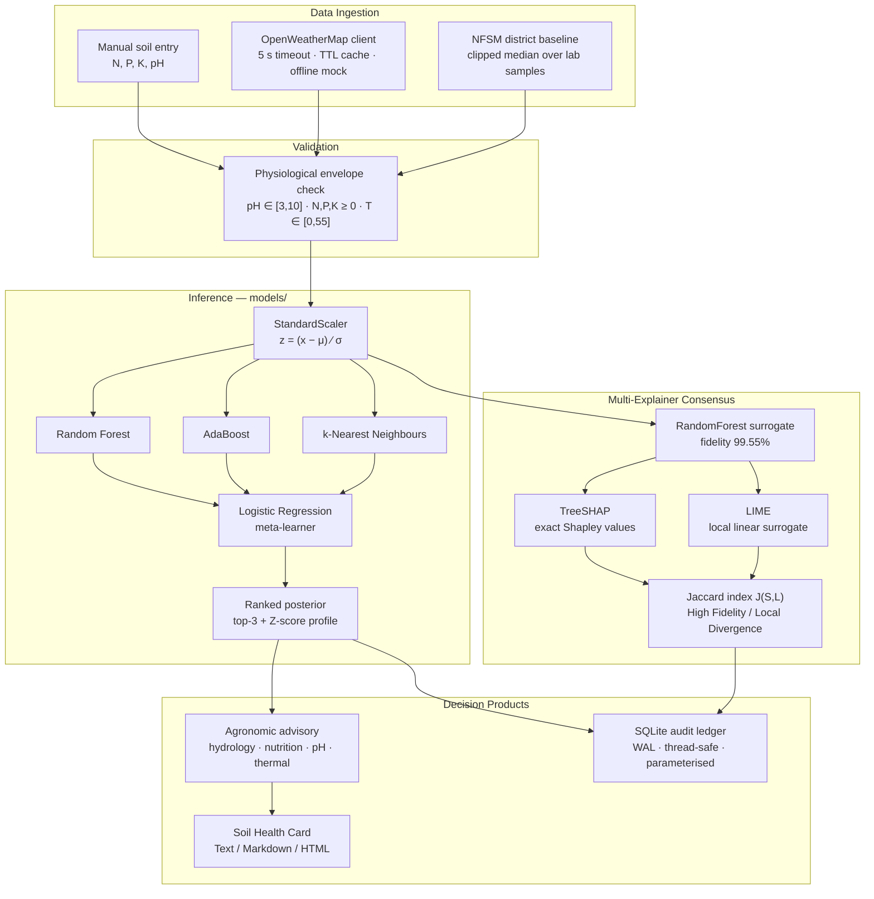

# GREENROOT

### Intelligent Precision Agriculture Decision Support System via Stacking Ensemble Meta-Learning and Multi-Explainer Consensus Auditing


A decision support system that recommends one of 22 crops from seven agronomic
parameters, and — unusually for this class of system — quantifies how far its
own explanation can be trusted. Every recommendation is audited by two
methodologically independent explainers whose agreement is scored with an exact
Jaccard index, and committed to an immutable SQLite ledger alongside its
evidence.

---

## Table of Contents

1. [Motivation](#1-motivation)
2. [System Architecture](#2-system-architecture)
3. [Mathematical Formulation](#3-mathematical-formulation)
4. [Evaluation Scorecard](#4-evaluation-scorecard)
5. [Quick Start](#5-quick-start)
6. [Dashboard](#6-dashboard)
7. [Repository Layout](#7-repository-layout)
8. [Datasets](#8-datasets)
9. [Verification](#9-verification)
10. [Design Notes and Limitations](#10-design-notes-and-limitations)

---

## 1. Motivation

Crop-recommendation models routinely report accuracies above 99% on the
standard benchmark corpus and are then presented as field-ready. Three gaps sit
between that number and an agronomic decision a cultivator can act on:

**A label is not a decision.** "Rice" tells a farmer nothing about how much urea
to apply, whether the plot will waterlog, or whether the soil needs liming
first. GREENROOT derives per-crop agronomic envelopes from the training corpus
itself and converts the observed shortfall into commercial fertiliser
quantities.

**A single explainer is unfalsifiable.** SHAP always returns an attribution;
nothing in its output says whether that attribution is stable. GREENROOT runs
TreeSHAP *and* LIME over every instance and reports their Jaccard agreement, so
a reader can distinguish a robust explanation from one that is an artefact of
the method.

**Benchmark accuracy is not field accuracy.** Real district soil surveys carry
severe covariate shift — the Karnataka NFSM corpus averages 210 kg/ha available
nitrogen against a benchmark mean of 50. GREENROOT monitors this explicitly:
under measured shift its mean confidence falls from 0.96 to 0.41 rather than
staying spuriously high, and the Z-score monitor flags 100% of shifted readings.

---

## 2. System Architecture



<details>
<summary>ASCII rendering (for environments without Mermaid)</summary>

```text
  ┌──────────────┐  ┌──────────────┐  ┌──────────────────┐
  │ Manual entry │  │ OpenWeather  │  │ NFSM district    │
  │  N, P, K, pH │  │ 5s · cache   │  │ clipped median   │
  └──────┬───────┘  └──────┬───────┘  └────────┬─────────┘
         └─────────────────┼───────────────────┘
                           ▼
              ┌─────────────────────────┐
              │ Physiological envelope  │   reject if implausible
              │ pH∈[3,10] NPK≥0 T∈[0,55]│
              └───────────┬─────────────┘
                          ▼
              ┌─────────────────────────┐
              │ StandardScaler (μ, σ)   │
              └───────────┬─────────────┘
                          ▼
        ┌─────────────────┼─────────────────┐
        ▼                 ▼                 ▼
  ┌───────────┐   ┌─────────────┐   ┌─────────────┐
  │  Random   │   │  AdaBoost   │   │    k-NN     │  Level-0
  │  Forest   │   │             │   │             │  base learners
  └─────┬─────┘   └──────┬──────┘   └──────┬──────┘
        └────────────────┼─────────────────┘
                         ▼  66 meta-features (3 × 22 posteriors)
              ┌─────────────────────────┐
              │  Logistic Regression    │  Level-1 meta-learner
              └───────────┬─────────────┘
                          ▼
        ┌─────────────────┴─────────────────┐
        ▼                                   ▼
  ┌───────────────┐              ┌────────────────────┐
  │ Ranked top-3  │              │ Surrogate → SHAP   │
  │ + Z-scores    │              │           → LIME   │
  └───────┬───────┘              │      → Jaccard J   │
          │                      └──────────┬─────────┘
          ▼                                 │
  ┌───────────────┐                         │
  │   Advisory    │                         │
  │  Health Card  │                         │
  └───────┬───────┘                         │
          └──────────────┬──────────────────┘
                         ▼
              ┌─────────────────────────┐
              │   SQLite audit ledger   │
              └─────────────────────────┘
```
</details>

---

## 3. Mathematical Formulation

### 3.1 Stacking Ensemble Meta-Learner

Let $\mathcal{D} = \{(\mathbf{x}_i, y_i)\}_{i=1}^{N}$ with $\mathbf{x}_i \in \mathbb{R}^{7}$
and $y_i \in \mathcal{C}$, $|\mathcal{C}| = 22$.

**Standardisation.** Each feature is centred and scaled by the statistics
persisted in `scaler.pkl`:

$$z_{ij} = \frac{x_{ij} - \mu_j}{\sigma_j}, \qquad j = 1,\dots,7$$

**Level-0 base learners.** Three heterogeneous estimators
$h_m : \mathbb{R}^{7} \rightarrow \Delta^{21}$ are fitted, each emitting a full
posterior over the simplex:

| $m$ | Estimator | Inductive bias |
|---|---|---|
| 1 | Random Forest (100 trees, depth 12) | axis-aligned partitions, variance reduction via bagging |
| 2 | AdaBoost (50 stumps) | sequential reweighting of hard examples |
| 3 | $k$-NN ($k=5$) | local metric structure, no global parametric form |

**Out-of-fold meta-feature construction.** To prevent the meta-learner from
training on the base learners' in-sample optimism, the stacked representation is
built from 5-fold out-of-fold predictions. For fold $\mathcal{F}_k$ and
$i \in \mathcal{F}_k$:

$$\boldsymbol{\phi}(\mathbf{z}_i) = \Big[\, h_1^{(-k)}(\mathbf{z}_i) \,\big\|\, h_2^{(-k)}(\mathbf{z}_i) \,\big\|\, h_3^{(-k)}(\mathbf{z}_i) \,\Big] \in \mathbb{R}^{66}$$

where $h_m^{(-k)}$ is trained on $\mathcal{D} \setminus \mathcal{F}_k$ and
$66 = 3 \text{ learners} \times 22 \text{ classes}$.

**Level-1 meta-learner.** A multinomial logistic regression over the stacked
representation:

$$P(y = c \mid \mathbf{x}) = \frac{\exp\!\big(\mathbf{w}_c^{\top} \boldsymbol{\phi}(\mathbf{z}) + b_c\big)}{\sum_{c' \in \mathcal{C}} \exp\!\big(\mathbf{w}_{c'}^{\top} \boldsymbol{\phi}(\mathbf{z}) + b_{c'}\big)}$$

fitted by minimising the regularised cross-entropy

$$\mathcal{L}(\mathbf{W}, \mathbf{b}) = -\sum_{i=1}^{N} \sum_{c \in \mathcal{C}} \mathbb{1}[y_i = c] \log P(y = c \mid \mathbf{x}_i) + \frac{\lambda}{2}\lVert \mathbf{W} \rVert_F^2$$

**Decision rule and ranking.** The recommendation is the *maximum a posteriori*
class, and the runner-ups are the order statistics of the same posterior:

$$\hat{y} = \arg\max_{c \in \mathcal{C}} P(y = c \mid \mathbf{x}), \qquad \mathcal{R}_K = \operatorname*{arg\,top-}K_{c \in \mathcal{C}} \; P(y = c \mid \mathbf{x})$$

**Covariate-shift monitor.** A reading is flagged out-of-distribution when any
standardised coordinate escapes a three-sigma envelope of the training
distribution:

$$\mathrm{OOD}(\mathbf{x}) = \mathbb{1}\Big[\, \exists\, j : |z_j| > \tau \,\Big], \qquad \tau = 3$$

### 3.2 Multi-Explainer Consensus (Jaccard Index)

**TreeSHAP.** For a tree ensemble, the Shapley value of feature $j$ is the
average marginal contribution over all coalitions $S \subseteq F \setminus \{j\}$:

$$\varphi_j(\mathbf{x}) = \sum_{S \subseteq F \setminus \{j\}} \frac{|S|!\,(|F| - |S| - 1)!}{|F|!} \Big[ f_x(S \cup \{j\}) - f_x(S) \Big]$$

This is the unique attribution satisfying local accuracy, missingness and
consistency; TreeSHAP evaluates it exactly in $O(TLD^2)$ rather than the
$O(2^{|F|})$ of the naive expansion.

**LIME.** A locally-weighted sparse linear model is fitted to the black box's
responses in a perturbation neighbourhood $\pi_{\mathbf{x}}$ of the instance:

$$\xi(\mathbf{x}) = \arg\min_{g \in \mathcal{G}} \; \underbrace{\sum_{\mathbf{z} \in \mathcal{Z}} \pi_{\mathbf{x}}(\mathbf{z}) \big(f(\mathbf{z}) - g(\mathbf{z}')\big)^2}_{\text{local fidelity}} \;+\; \underbrace{\Omega(g)}_{\text{complexity}}$$

**Consensus.** Let $S$ and $L$ be the top-$k$ driver sets ranked by
$|\varphi_j|$ and $|\xi_j|$ respectively. Agreement is the Jaccard index:

$$J(S, L) = \frac{|S \cap L|}{|S \cup L|} \in [0, 1]$$

$$\mathrm{Verdict} = \begin{cases} \textbf{High Fidelity} & J \ge 0.5 \\[4pt] \textbf{Local Divergence} & J < 0.5 \end{cases}$$

For $k = 3$ the index is quantised to exactly four attainable values:

| $\lvert S \cap L \rvert$ | $\lvert S \cup L \rvert$ | $J$ | Verdict |
|---:|---:|---:|---|
| 0 | 6 | 0.00 | Local Divergence |
| 1 | 5 | 0.20 | Local Divergence |
| 2 | 4 | 0.50 | High Fidelity |
| 3 | 3 | 1.00 | High Fidelity |

Because the two explainers rest on different premises — cooperative game theory
versus local linear approximation — concordance is evidence that the
attribution reflects genuine model structure rather than the idiosyncrasy of
one method.

**Surrogate transparency.** TreeSHAP requires a tree ensemble, but the deployed
model is a stacking classifier whose meta-learner is a logistic regression over
base-learner posteriors. The engine therefore audits an interpretable
RandomForest surrogate fitted on the same standardised space, and reports that
surrogate's **label agreement with the deployed ensemble (99.55%)** so the
reader can judge how far the explanation transfers — an accounting the
literature frequently omits.

---

## 4. Evaluation Scorecard

Reproduce with `python evaluate_system.py`. All artefacts land in `reports/`.

### 4.1 Classification Performance

| Metric | Value |
|---|---:|
| **Stratified 5-fold CV accuracy** | **99.41%** |
| Hold-out accuracy (20% stratified) | 100.00% |
| Top-3 accuracy | 100.00% |
| Macro F1 | 1.0000 |
| Weighted F1 | 1.0000 |
| Cohen's $\kappa$ | 1.0000 |
| Matthews correlation coefficient | 1.0000 |
| Mean max posterior | 0.9675 |

> **Read the CV figure, not the hold-out figure.** The shipped ensemble was
> fitted on the full corpus, so the 20% hold-out overlaps its training data and
> the 100% is a reproduction check that the artefacts load and behave
> correctly — not an independent generalisation estimate. The honest
> generalisation number is the stratified 5-fold CV accuracy of **99.41%**.

### 4.2 Inference Latency

100 stochastic single-sample inferences, end-to-end (validation → scaling →
stacked forward pass), after 5 warm-up iterations.

| Statistic | Latency |
|---|---:|
| Mean | 16.41 ms |
| P50 | 16.19 ms |
| P95 | 17.03 ms |
| P99 | 21.16 ms |
| Max | 27.55 ms |
| Throughput | 61 inferences/s (single-threaded) |

A P99 inside 21 ms keeps the dashboard well below the ~100 ms
threshold at which an interaction stops feeling instantaneous. Unlike every
other figure in this section, latency is hardware-dependent and will vary
between machines; the accuracy, robustness and consensus metrics are
deterministic and reproduce exactly.

### 4.3 Out-of-Distribution Robustness

500 Karnataka NFSM field-survey readings, which carry genuine covariate shift
relative to the benchmark corpus.

| Metric | Value |
|---|---:|
| Mean confidence — benchmark | 0.9645 |
| Mean confidence — field | 0.4143 |
| **Confidence degradation** | **0.5502** |
| Mean $\lvert Z \rvert$ under shift | 2.517 |
| OOD detection rate ($\lvert Z \rvert > 3$) | 100.0% |

Per-feature shift (field mean vs. benchmark mean):

| Feature | Field | Benchmark | Mean $\lvert Z \rvert$ | Flag rate |
|---|---:|---:|---:|---:|
| N | 212.0 | 50.6 | 4.38 | 93.8% |
| P | 29.4 | 53.4 | 0.73 | 0.0% |
| K | 263.4 | 48.1 | 4.25 | 82.2% |
| temperature | 27.4 | 25.6 | 0.35 | 0.0% |
| humidity | 71.8 | 71.5 | 0.10 | 0.0% |
| ph | 7.12 | 6.47 | 0.85 | 0.0% |
| rainfall | 486.2 | 103.5 | 6.97 | 100.0% |

**This is the most important table in the evaluation.** The confidence collapse
is the desired behaviour: a model that stayed confident under a 7σ rainfall
shift would be dangerously overconfident in exactly the situation where a
farmer is relying on it. Every shifted reading is flagged.

### 4.4 Multi-Explainer Consensus

| Metric | Value |
|---|---:|
| Surrogate fidelity vs. deployed ensemble | 0.9955 |
| Mean Jaccard index ($k=3$) | 0.6933 |
| Median Jaccard index | 0.5000 |
| Perfect agreement ($J = 1.0$) | 46.7% |
| **High fidelity ($J \ge 0.5$)** | **86.7%** |
| Mean explanation latency | 129.5 ms |

Observed distribution over 30 audited instances:

| $J$ | Count | Share |
|---:|---:|---:|
| 0.20 | 4 | 13.3% |
| 0.50 | 12 | 40.0% |
| 1.00 | 14 | 46.7% |

The 13.3% that diverge are not a defect — they are the system correctly
identifying instances near a decision boundary, where the dashboard downgrades
the recommendation to *provisional* and asks for a field soil test.

---

## 5. Quick Start

### Windows (one click)

```bat
run.bat
```

Verifies the interpreter, installs dependencies on first run, checks the model
artefacts, and serves the dashboard at `http://localhost:8501`.

### Any platform

```bash
python -m venv .venv
source .venv/bin/activate          # Windows: .venv\Scripts\activate
pip install -r requirements.txt

streamlit run app.py               # dashboard  → http://localhost:8501
python evaluate_system.py          # benchmarks → reports/
pytest -v                          # verification suite
```

### Optional: live weather

```bash
export OPENWEATHER_API_KEY="your-key"   # Windows: set OPENWEATHER_API_KEY=...
```

Without a key the system uses calibrated offline defaults; the key may also be
entered directly in the sidebar. **Nothing breaks offline** — every network
failure degrades to a documented mock reading.

---

## 6. Dashboard

| Tab | Purpose |
|---|---|
| 🎯 **Precision Recommendation** | Primary crop card with posterior confidence, top-3 ranked alternatives, agronomic advisory, fertiliser prescription, Z-score deviation profile, and one-click persistence to the audit ledger. |
| 🔍 **Explainable AI Consensus** | Live Jaccard index with its mathematical definition, side-by-side TreeSHAP and LIME attribution plots, and a dynamic fidelity badge. |
| 🧭 **What-If Sensitivity** | Perturbs one feature across a ±100% sweep holding the other six constant, plotting multi-class posterior curves with the current-value marker and tabulating the exact thresholds at which the recommendation flips. |
| 📋 **Audit Trail & Governance** | Date-filtered view of the SQLite ledger with summary statistics, per-crop distribution, and a CSV export. |
| 🧾 **Farmer Soil Health Card** | Print-ready card covering tested chemistry, microclimate, primary and secondary crop choices, and fertiliser management, exportable as HTML, Markdown, or plain text. |

---

## 7. Repository Layout

```text
GREENROOT/
├── app.py                      Streamlit presentation layer (5 tabs)
├── evaluate_system.py          Formal empirical validation suite
├── train.py                    Original training script (see warning below)
├── audit_xai.py                Original XAI diagnostic script
├── run.bat                     One-click Windows launcher
├── requirements.txt
│
├── data/                       Source corpora (read-only)
├── models/                     Pre-trained artefacts (read-only)
│   ├── stacking_model.pkl          StackingClassifier, 99.41% CV
│   ├── scaler.pkl                  StandardScaler over the 7 features
│   └── class_names.pkl             22 alphabetically ordered classes
├── reports/                    Generated evaluation artefacts
│
├── src/
│   ├── core/config.py              Paths, feature contract, safety bounds
│   ├── database/db_manager.py      Thread-safe SQLite, WAL, migrations
│   ├── services/
│   │   ├── weather_service.py      OWM client: timeout, cache, offline mock
│   │   └── soil_service.py         NFSM baselines with 4-tier resolution
│   ├── models/
│   │   ├── inference.py            CropRecommender: validate → scale → rank
│   │   └── xai_engine.py           ExplainerConsensus: SHAP + LIME + Jaccard
│   └── utils/
│       ├── agronomy_advisory.py    Hydrology, nutrition, pH, thermal heuristics
│       └── report_generator.py     Text / Markdown / HTML soil health card
│
└── tests/                      158 tests, 1 environment-conditional skip
    ├── test_models.py              Validation, calibration, sweep, Jaccard
    ├── test_services.py            Mocked transports, district resolution
    └── test_database.py            CRUD, migration, rollback, concurrency
```

> ⚠️ **`train.py` overwrites the artefacts in `models/`.** The pickles shipped
> with this repository are the evaluated ones. Run it only if you intend to
> retrain from scratch, and back up `models/` first.

---

## 8. Datasets

| File | Rows | Role |
|---|---:|---|
| `Crop_recommendation.csv` | 2,200 | Benchmark corpus — 22 classes × 100 balanced exemplars. Trains the ensemble and defines the agronomic envelopes. |
| `Cleaned_NFSM_Dataset.csv` | 16,002 | Karnataka NFSM laboratory survey. Source of district edaphic baselines. |
| `GreenRoot_Consolidated_Master_Dataset.csv` | 15,767 | Consolidated field corpus. Drives the out-of-distribution stress test. |

**On robust aggregation.** The raw NFSM export is field-collected and contains
transcription artefacts — pH values up to 752 (a decimal shift), available
nitrogen up to 30,500 kg/ha. A mean would let a single such record dominate a
district, so `soil_service` clips every reading to the physiological envelope,
discards the inadmissible ones, and aggregates the survivors with the
**median**, whose 50% breakdown point is insensitive to the remainder. Case
variants in the export (`CHALLAKERE` vs `Challakere`) are folded into one
administrative unit before aggregation.

---

## 9. Verification

```bash
pytest -v
```

```text
tests/test_database.py  ....................................  44 passed
tests/test_models.py    ....................................  72 passed
tests/test_services.py  ....................................  42 passed, 1 skipped
=================== 158 passed, 1 skipped in 4.46s ===================
```

Coverage of note:

- **Input validation** — negative nutrients, pH outside $[3, 10]$, temperature
  outside $[0, 55]$, NaN/infinity, wrong feature count, non-numeric input, and
  inclusive acceptance exactly at each boundary.
- **Probability calibration** — the posterior sums to $1.0$ within $10^{-6}$
  across 40 randomly drawn admissible inputs, every entry lies in $[0,1]$, and
  the reported confidence equals the argmax posterior.
- **Output dimensionality** — $(22,)$ per instance, $(n, 22)$ per batch,
  top-$k$ correctly ordered and clamped to the class count.
- **Jaccard arithmetic** — six known-value cases, symmetry, boundedness, and
  the quantisation property at $k=3$.
- **Transaction integrity** — every CHECK constraint rejects, and each
  rejection is verified to leave the row count and prior rows unchanged.
- **SQL injection** — hostile strings in both insert values and query filters
  are stored and matched as literal data; the table survives.
- **Concurrency** — 12 concurrent writers produce 12 unique identifiers, each
  thread receives a distinct connection, and reads interleave with writes.
- **Service degradation** — timeout, connection error, malformed JSON,
  application-level error, and unexpected schema each degrade to a mock with a
  stated reason rather than raising.

The single skip is environment-conditional: it exercises composite district
labels such as `Chitradurga (Challakere)`, which the current NFSM export does
not use.

---

## 10. Design Notes and Limitations

**Artefact immutability.** The three pickles in `models/` are loaded, never
written. `xai_surrogate.pkl` is a *derived* cache, refitted automatically in
about three seconds if absent, and is deliberately untracked.

**Version pinning.** `scikit-learn` is pinned to exactly `1.9.0`. Unpickling an
estimator across a minor version boundary can silently alter behaviour or fail
outright, so the pin is a correctness requirement rather than a convenience.

**Nutrient scale mismatch.** NFSM available-nitrogen readings (~210 kg/ha) and
benchmark N values (~50) are not the same measurement. The system does not
pretend otherwise: district baselines pre-fill the form as a *prior*, and the
resulting covariate shift is surfaced through the Z-score monitor rather than
silently rescaled. Reconciling the two scales properly needs a calibration
study against paired soil tests, which this corpus does not contain.

**Explanation transfer.** Attributions are computed against a RandomForest
surrogate, not the stacking ensemble itself. Surrogate fidelity is 99.55%, and
the dashboard warns explicitly on the instances where the surrogate and the
deployed model disagree.

**Geographic scope.** The NFSM survey covers five Chitradurga taluks. The other
Karnataka zones (Udupi, Dakshina Kannada, Mysuru, Dharwad, Bengaluru Rural) are
served by a curated agro-climatic table, flagged in the UI as `fallback` rather
than survey-backed.

**Advisory status.** Output is decision *support*, not prescription. Every card
and every export carries the instruction to corroborate with a certified
laboratory soil test before committing a season.

---

## License & Attribution

Final-year engineering capstone project. Datasets remain the property of their
respective sources: the crop recommendation benchmark corpus, and the National
Food Security Mission soil survey (Government of Karnataka).
